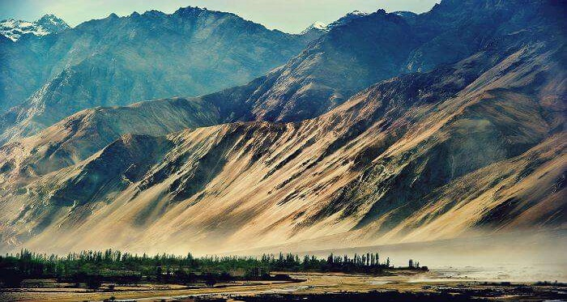

I am a great lover of this beautiful planet. The Earth and the variety of species it holds always gives me an unquantifiable level of happiness. But our Earth faces more challenges now, more than ever. Luckily, I can contribute my part in the run to preserve the Earth as we find it amusing. As a geospatial enthusiast, I hope to use my abilities to work with GIS technologies for the better.

Fundamentally I am a GIS Developer who graduated in Geoinformatics. I am highly skilled in Javascript, Python, ReactJS and C#. My work predominantly revolves around developing web-based GIS applications. Because of the power of Geospatial and it's ability to address a lot of problems in various different sectors apart from Earth Observation, my professional experience also is varied, ranging from developing GIS based applications for managing national security to aid in large-scale construction to helping the urban planners and so on.

I, personally, am interested in using GIS for Earth Observation and am equipping myself on an every-day basis to solve various problems using geostatistical analysis and machine learning.

#### Let's Chat

To have an interesting chat, contact me at: 
monicamons12@gmail.com